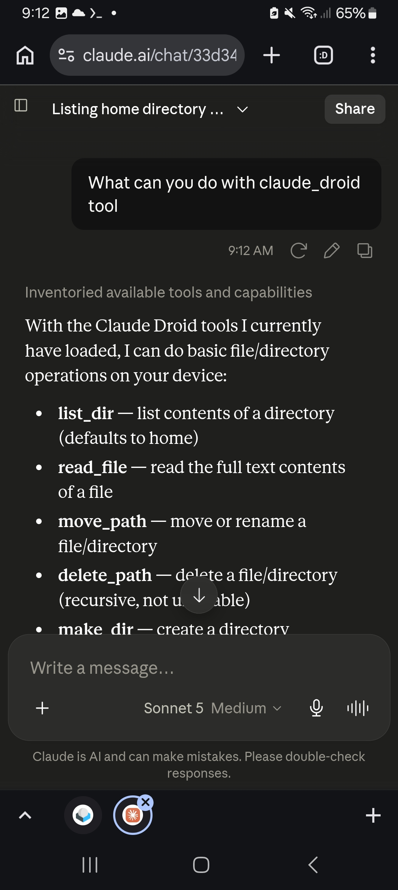
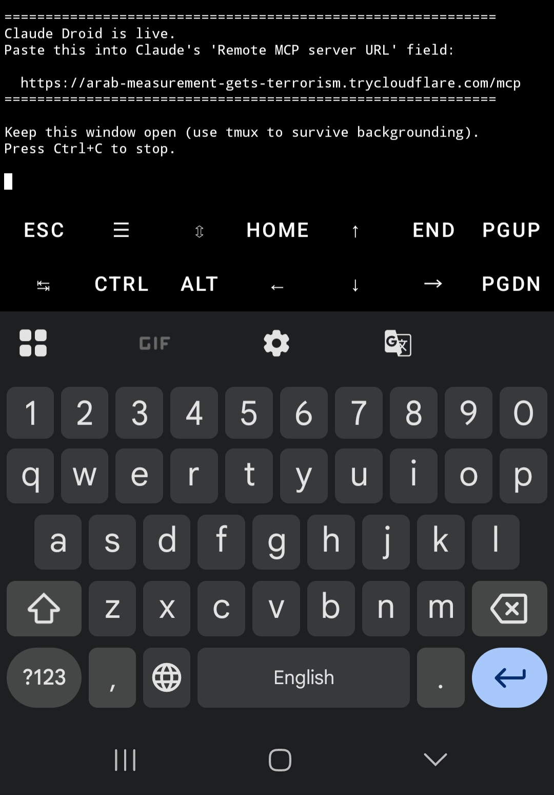
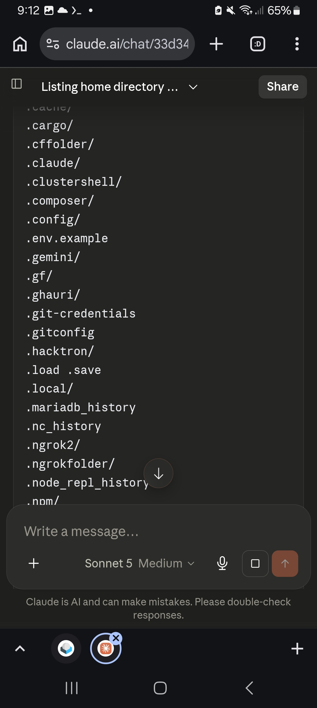

# Claude Droid


Turn your Android phone into a remote-controllable tool server for [Claude](https://claude.ai) — no root, no heavy dependencies, just Termux.

Claude Droid runs a lightweight [MCP](https://modelcontextprotocol.io) (Model Context Protocol) server inside [Termux](https://termux.dev), exposes it to the internet through a free Cloudflare Tunnel, and connects it to the Claude app as a custom connector. Once connected, Claude can run shell commands, read/write files, and manage your filesystem directly on your device — from any chat, on any of your devices.

This gives Claude real shell access to your phone. Read the [Security](#security) section before using this on a daily-driver device.

---

## What Claude can do with it

Once the connector is enabled in a chat, you can just ask Claude naturally:

- "List everything in my Downloads folder"
- "Create a file called notes.txt with my grocery list"
- "Check my battery status" (with `termux-api` installed)
- "Install git and clone this repo"
- "Read my `.bashrc` and tell me what's in it"
- "Write a Python script that does X and run it"
- "Move all `.jpg` files from Downloads into a new Photos folder"
- "Delete that temp file we made earlier"

Under the hood, Claude has access to nine tools:

| Tool | What it does |
|---|---|
| `run_command` | Executes any shell command in Termux, returns stdout/stderr/exit code |
| `read_file` | Reads the full contents of a text file |
| `write_file` | Creates or overwrites a file with given content |
| `append_file` | Appends text to an existing (or new) file |
| `list_dir` | Lists a directory's contents (dirs marked with `/`) |
| `make_dir` | Creates a directory, including missing parents |
| `delete_path` | Deletes a file or directory (recursively) |
| `move_path` | Moves or renames a file or directory |
| `file_info` | Returns size, type, and last-modified time for a path |

Since `run_command` can run anything Termux can run, this effectively gives Claude full access to whatever your Termux environment can do — installing packages, running scripts, using `git`, `curl`, `python`, `node`, `termux-api` hardware commands, and more.

---

## How it works

```
┌──────────────────┐        ┌───────────────────┐        ┌────────────────────┐        ┌───────────────┐
│   Claude app      │  MCP   │  Anthropic cloud   │  HTTPS │  Cloudflare Tunnel │  HTTP  │  Termux (you)  │
│ (iOS/Android/web) │◄──────►│ (routes connector  │◄──────►│    (public URL)    │◄──────►│ claude_droid.py│
└──────────────────┘  JSON-  │   requests)        │        │                    │  RPC   └───────────────┘
                       RPC   └───────────────────┘        └────────────────────┘
```

1. `claude_droid.py` starts a minimal HTTP server, built entirely on the Python standard library, no pip packages needed, that speaks MCP's JSON-RPC 2.0 protocol over HTTP.
2. It launches a Cloudflare Quick Tunnel (`cloudflared`), a free, no-signup tunnel that gives your phone a public HTTPS URL pointing at the local server.
3. You add that URL as a custom connector in the Claude app (Settings, Connectors, Add custom connector).
4. When you chat with Claude and enable the connector, Claude's backend, not your phone directly, sends MCP requests to your tunnel URL: `tools/list` to discover what's available, `tools/call` to actually run something.
5. Your script executes the request locally in Termux and sends the result back through the same chain.

Because custom connectors are always reached from Anthropic's cloud infrastructure rather than from your device, your MCP server must be reachable over the public internet, which is exactly what the tunnel provides.

No official `mcp` SDK, no `pydantic`, no Rust compilation. This was built from scratch as a plain `http.server` handler specifically so it runs on resource-constrained phones without native-dependency build failures.

---

## Showcase

<p align="center">
  
  
  
</p>

---

## Setup

### Requirements
- Android phone with [Termux](https://f-droid.org/packages/com.termux/) installed (F-Droid build recommended over Play Store)
- A [Claude](https://claude.ai) account (any plan)

### Install

```bash
pkg update
pkg install python cloudflared -y
```

### Run

```bash
python claude_droid.py
```

You'll see output like:

```
Starting Cloudflare quick tunnel (no signup needed)...

============================================================
Claude Droid is live.
Paste this into Claude's 'Remote MCP server URL' field:

  https://random-words-here.trycloudflare.com/mcp
============================================================

Keep this window open (use tmux to survive backgrounding).
Press Ctrl+C to stop.
```

### Connect it to Claude

1. Open the Claude app, go to Settings, Connectors, Add custom connector
2. Name: `Claude Droid`
3. Remote MCP server URL: the URL printed above (must end in `/mcp`)
4. Leave OAuth fields blank
5. Tap Add
6. In any chat, tap the plus button and enable Claude Droid for that conversation

That's it. Ask Claude to do something on your phone.

### Keeping it alive

Termux gets killed by Android's battery optimizer by default, which kills the tunnel too. To keep Claude Droid running long-term:

- Run it inside `tmux` so it survives the terminal session closing
- Disable battery optimization for Termux (Android Settings, Apps, Termux, Battery, Unrestricted)
- Optionally use [Termux:Boot](https://wiki.termux.com/wiki/Termux:Boot) to auto-start it on device boot

Free Cloudflare Quick Tunnel URLs are not stable. Every time you restart the script, you get a new URL and have to update the connector in Claude.

---

## Security

This is a hobby and personal-use project. Please understand the tradeoffs:

- No authentication. Anyone who has your tunnel URL has the same shell access you do, no login, no confirmation prompts. Don't share the URL, and don't leave it running unattended for long stretches.
- No sandboxing. `run_command` executes with the same permissions as your Termux user. Destructive commands (`rm -rf`, overwriting configs, etc.) will actually run, and there's no undo.
- Random URLs help but aren't a security boundary. Cloudflare Quick Tunnel URLs are hard to guess, but they're not a substitute for real authentication if you plan to run this continuously.
- Command timeout. `run_command` kills anything running longer than 60 seconds by default (pass `timeout_seconds` to override per call).
- Recommended for a secondary or dev device, short sessions, or trusted personal use, not a daily-driver phone with sensitive accounts logged in, run continuously with no oversight.

If you want to harden this further, consider adding:
- A bearer-token check in the HTTP handler that rejects requests without a shared secret header
- An allowlist of permitted commands or paths instead of arbitrary shell execution
- Cloudflare's authenticated tunnels (`cloudflared tunnel login`) instead of Quick Tunnels, for a stable, access-controlled URL

---

## Troubleshooting

**`cloudflared: command not found`**
Run `pkg install cloudflared -y` and make sure it completes without errors.

**Connector shows an error or times out in the Claude app**
Make sure `claude_droid.py` is still running in Termux and the tunnel URL hasn't changed since you added it. Restart the script and update the URL in the connector settings if needed.

**Commands work but hardware features (camera, sensors, notifications) don't**
Install the separate [`termux-api`](https://wiki.termux.com/wiki/Termux:API) package and its companion Termux:API app from F-Droid.

**Full storage access needed**
Run `termux-setup-storage` once to grant Termux access to your phone's shared storage (Downloads, Pictures, etc.), otherwise Termux is sandboxed to its own app directory.

---

## License

MIT. Use, modify, and share freely. No warranty; see the Security section above.
